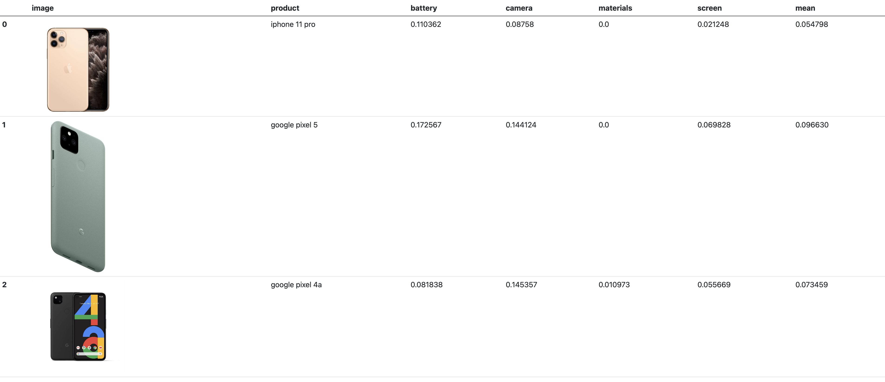
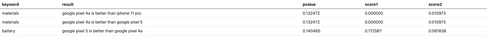
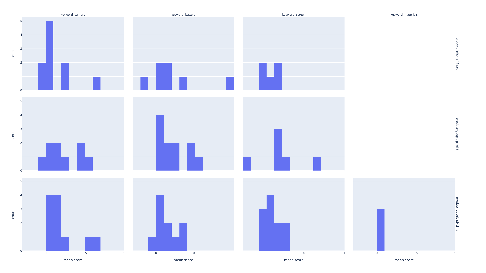
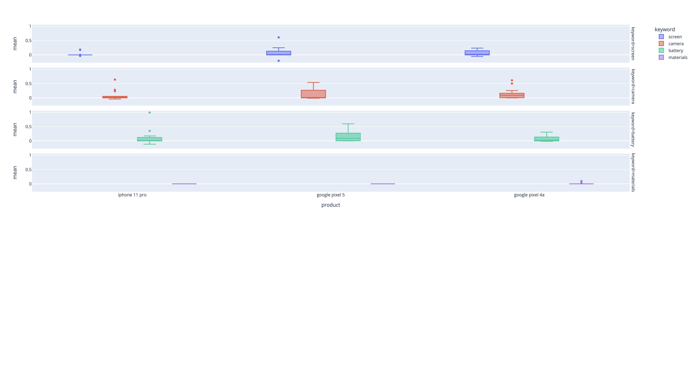
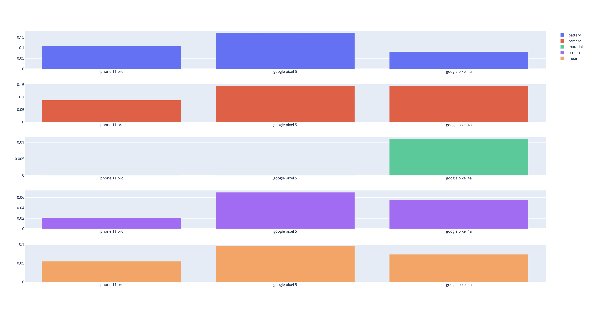

<!--
*** Thanks for checking out this README Template. If you have a suggestion that would
*** make this better, please fork the repo and create a pull request or simply open
*** an issue with the tag "enhancement".
*** Thanks again! Now go create something AMAZING! :D
-->


<!-- PROJECT SHIELDS -->
<!--
*** I'm using markdown "reference style" links for readability.
*** Reference links are enclosed in brackets [ ] instead of parentheses ( ).
*** See the bottom of this document for the declaration of the reference variables
*** for contributors-url, forks-url, etc. This is an optional, concise syntax you may use.
*** https://www.markdownguide.org/basic-syntax/#reference-style-links
-->
[![Contributors][contributors-shield]][contributors-url]
[![Forks][forks-shield]][forks-url]
[![Stargazers][stars-shield]][stars-url]
[![Issues][issues-shield]][issues-url]
[![MIT License][license-shield]][license-url]
[![LinkedIn][linkedin-shield]][linkedin-url]


<!-- PROJECT LOGO -->
<br />
<p align="center">
  <a href="https://github.com/inotin/reviewlyzer">
    
  </a>

  <p align="center">
    A tool for a quantitative assessment of reviews of products inculding YouTube videos
    <br />
    <br />
    <a href="https://github.com/inotin/reviewlyzer">View Demo</a>
    ·
    <a href="https://github.com/inotin/reviewlyzer/issues">Report Bug</a>
    ·
    <a href="https://github.com/inotin/reviewlyzer/issues">Request Feature</a>
  </p>
</p>


<!-- TABLE OF CONTENTS -->
## Table of Contents

* [About the Project](#about-the-project)
  * [Built With](#built-with)
* [Getting Started](#getting-started)
  * [Prerequisites](#prerequisites)
  * [Installation](#installation)
* [Usage](#usage)
* [Roadmap](#roadmap)
* [Contributing](#contributing)
* [License](#license)
* [Contact](#contact)
* [Acknowledgements](#acknowledgements)


<!-- ABOUT THE PROJECT -->
## About The Project

<!-- [![Product Name Screen Shot][product-screenshot]](https://example.com). -->


Once upon a time I realized that if you want to get objective information about some product, you have to spend a vast amount of time reading and watching reviews to distill valuable facts. The tool that I am trying to implement provides quantitative assessment for a feature of products.

What are the inputs?
* Product names
* Important features you would like to  compare

That's it!
What will you get?
* The comparative quantified assessment of products by their feature/features

Of course, there's a lot to do to calibrate the model but I get the results pretty close to expected.

### To Do List
- [x] Make initial commit
- [x] Add comments to the functions
- [x] Implement semantic analysis using Vader
- [x] Update README.md.
- [x] Weird things are going on with p-values. Recheck the corresponding function
- [ ] Implement JSON output for results
- [ ] Implement automatic keywords detection
- [ ] Add support of text reviews


### Built With

* [youtube_transcript_api](https://pypi.org/project/youtube-transcript-api/)
* [youtube-search-python](https://pypi.org/project/youtube-search-python/)
* [NLTK](https://www.nltk.org)
* [DeepSegment](https://pypi.org/project/deepsegment/)


<!-- GETTING STARTED -->
## Getting Started

### Prerequisites

All necessary packages are listed in requirements.txt and can be installed as follows
```sh
pip install -r requirements.txt
```
In case you face issues with keras package, uninstall keras and keras-nightly and reinstall keras again.

### Installation

1. Clone the repo
```sh
git clone https://github.com/inotin/reviewlyzer.git
```
3. Install necessary packages
```sh
pip install -r requirements.txt
```
4. Run the script providing product names and keywords separated by ';'
```sh
python3 reviewlyzer.py 'iphone 11 pro;google pixel 5;google pixel 4a' 'screen;camera;battery;materials'
```

<!-- USAGE EXAMPLES -->
## Usage
Run the script providing product names and keywords separated by ';'
```sh
python3 reviewlyzer.py 'iphone 11 pro;google pixel 5;google pixel 4a' 'screen;camera;battery;materials'
```

The script generates html files with tables and plots and saves them into results/ folder for further use e.g., embed into iframes as it's done on [my website](https://notin.it/reviewlyzer)

The generated files are:
* reviewlyzerResults - a table with scores for each keyword and mean values for each product as well as product images found with Google Image search



* reviewlyzerPvalues - a table with pairwise scores of products with corresponding p-values (with a given threshold of 0.15)


* reviewlyzerHistograms - a plot with distributions of scores for each product


* reviewlyzerBoxPlots - a plot with boxplots of scores for each product


* reviewlyzerBarPlots - a bar plot with bar plots of scores for each product including mean scores


<!-- ROADMAP -->
## Roadmap

See the [open issues](https://github.com/inotin/reviewlyzer/issues) for a list of proposed features (and known issues).


<!-- CONTRIBUTING -->
## Contributing

Contributions are what make the open source community such an amazing place to be learn, inspire, and create. Any contributions you make are **greatly appreciated**.

1. Fork the Project
2. Create your Feature Branch (`git checkout -b feature/AmazingFeature`)
3. Commit your Changes (`git commit -m 'Add some AmazingFeature'`)
4. Push to the Branch (`git push origin feature/AmazingFeature`)
5. Open a Pull Request


<!-- LICENSE -->
## License

Distributed under the MIT License. See `LICENSE` for more information.


<!-- CONTACT -->
## Contact

Ilia Notin - ilia@notin.it

Project Link: [https://github.com/inotin/reviewlyzer](https://github.com/inotin/reviewlyzer)


<!-- ACKNOWLEDGEMENTS -->
## Acknowledgements
* [Template for README.md](https://github.com/othneildrew/Best-README-Template/graphs/contributors)


<!-- MARKDOWN LINKS & IMAGES -->
<!-- https://www.markdownguide.org/basic-syntax/#reference-style-links -->
[contributors-shield]: https://img.shields.io/github/contributors/inotin/reviewlyzer.svg?style=flat-square
[contributors-url]: https://github.com/inotin/reviewlyzer/graphs/contributors
[forks-shield]: https://img.shields.io/github/forks/inotin/reviewlyzer.svg?style=flat-square
[forks-url]: https://github.com/inotin/reviewlyzer/network/members
[stars-shield]: https://img.shields.io/github/stars/inotin/reviewlyzer.svg?style=flat-square
[stars-url]: https://github.com/inotin/reviewlyzer/stargazers
[issues-shield]: https://img.shields.io/github/issues/inotin/reviewlyzer.svg?style=flat-square
[issues-url]: https://github.com/inotin/reviewlyzer/issues
[license-shield]: https://img.shields.io/github/license/inotin/reviewlyzer.svg?style=flat-square
[license-url]: https://github.com/inotin/reviewlyzer/blob/master/LICENSE.txt
[linkedin-shield]: https://img.shields.io/badge/-LinkedIn-black.svg?style=flat-square&logo=linkedin&colorB=555
[linkedin-url]: https://www.linkedin.com/in/inotin/
[product-screenshot]: images/screenshot.png
